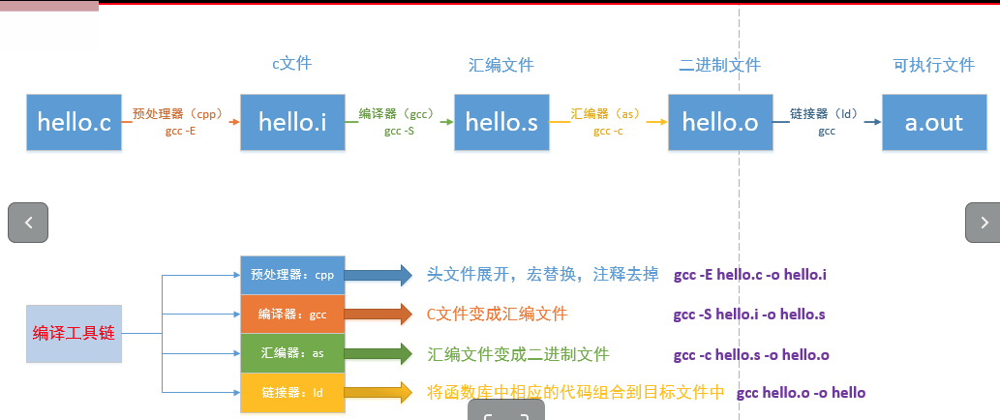

# 1. gcc编译
##1.1. gcc编译的四个阶段

 

## 1.2. gcc的一些参数的使用
命令格式：gcc [选项] [文件名]

| 参数 | 作用|
|:-------|:------|
|-E|仅仅执行编译预处理 |
|-s|将c代码转化为汇编代码|
|-c|仅执行编译操作，不进行连接操作|
|-o|指定生成的输出文件|
|-I|指定头文件的目录|
|-D|指定一个宏
|-O[level]|优化代码,level的范围为0-3,3为最高优化|
|-Wall|输出警告信息|
|-g|增加调试信息|
|-L|指定库的目录|
|-l|指定库的名字|


# 2.静态库
## 2.1 命名规则
命名规则：`lib + 库的名字 + .a`
例如 libmytest.a，其中静态库的名字为mytest

## 2.2 制作静态库
* 生产对应的.o文件
* 将生成的.o文件打包: `ar rcs + 静态库的名字(libMytest.a) + 生成的所有的.o`
* 发布和使用静态库: 1). 发布静态库   2). 头文件


***Demo:***制作加减乘除四则运算的静态库
(1)  代码结构如下

 
src目录结构
 

(2)  生产对应的.o文件
`gcc *.c -I ../include -c`

(3) 将生成的,o文件打包：
`ar rcs libMytest.a ./*.o`

(4) 发布和使用静态库: 1). 发布静态库   2). 头文件
`mv ./libMytest.a  ../lib/`
　
(5)引用静态库

`gcc main.c -L lib -l Mytest -Iinclude -o test`


# 3. 动态库（共享库）
## 3.１　命名规则
命名规则：lib+名字+.so

## 3.2 制作动态库
 * 生成与位置无关的代码 (生成与位置无关的.o)
  * 将.o打包成共享库(动态库)
  
  
  ***Demo***
  (1) 生成与位置无关的代码 (生成与位置无关的.o)
  `gcc -fPIC -c *.c -I../include`
  
  (2)将.o打包成共享库(动态库)
  `gcc -shared -o libMyCalc.so *.o -I../include`
  
  (3)使用动态库
  `gcc main.c lib/libMyCalc.so -o app -I include` 
  
## 3.3 动态库链接失败
在使用动态链接库的时候用　` gcc main.c -Llib -lMyCalc -o app -I include`，然后运行，有可能会报出如下的错误：`error while loading shared libraries: libMyCalc.so: cannot open shared object file: No such file or directory`.
使用`ldd app`查看程序动态链接库情况：
```
linux-vdso.so.1 =>  (0x00007ffc621e9000)
libMyCalc.so => not found
libc.so.6 => /lib/x86_64-linux-gnu/libc.so.6 (0x00007f592c49a000)
/lib64/ld-linux-x86-64.so.2 (0x00007f592c864000)

```
可以发现程序并没有找到我们所写的动态库

解决方法：
(１)把我们的动态库放到系统lib中: `sudo cp ./lib/libMyCalc.so /lib`(这个方法不建议使用)
(2)临时设置：`export LD_LIBRARY_PATH=库路径`，将当前目录加入环境变量，但是终端退出了就无效了。这是在开发动态库测试时使用
(3)永久设置：将上条写入家目录下`.bashrc`文件中.(终端关闭重新开才能生效)
(4) 将libmytest.so所在绝对路径追加入到/etc/ld.so.conf文件，使用sudo ldconfig -v 更新

**LD_LIBRARY_PATH**:
指定查找共享库（动态链接库）时除了默认路径之外的其他路径
该路径在默认路径之前查找.


  

  

