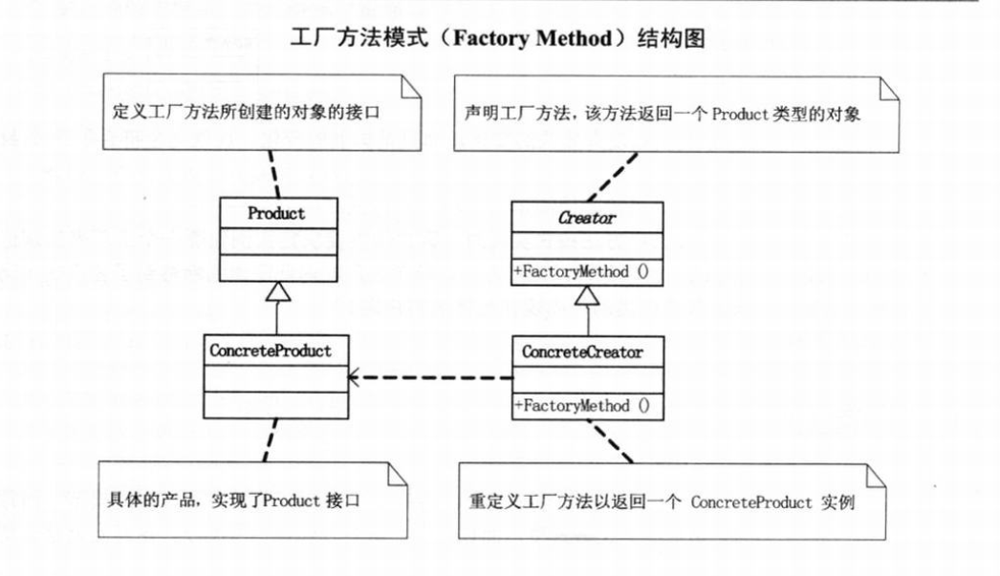
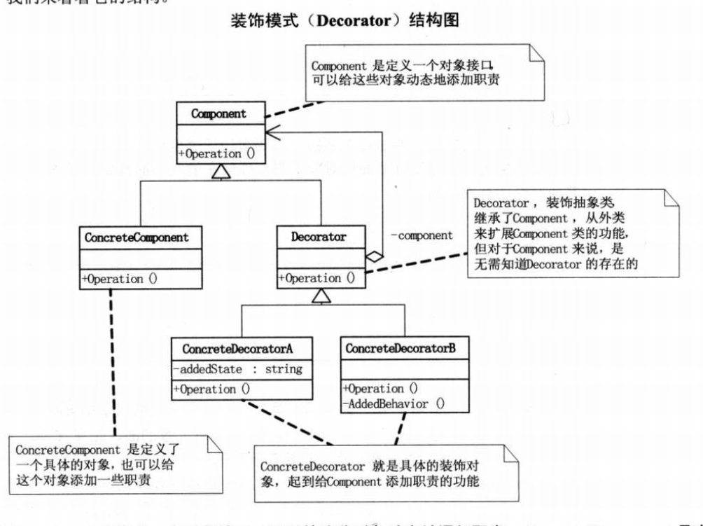

# 1. 设计模式编程基础

## 1.1 设计模式前言
模式归纳为三大类型，共23种。

**创建型模式** :  通常和对象的创建有关，涉及到对象实例化的方式。（共5种模式)
**结构型模式**： 描述的是如何组合类和对象以获得更大的结构。(共7种模式)
**行为型模式**： 用来对类或对象怎样交互和怎样分配职责进行描述。(共11种模式)

**创建型模式**用来处理对象的创建过程，主要包含以下5种设计模式： 
1. 工厂方法模式（Factory Method Pattern）的用意是定义一个创建产品对象的工厂接口，将实际创建工作推迟到子类中。
2. 抽象工厂模式（Abstract Factory Pattern）的意图是提供一个创建一系列相关或者相互依赖的接口，而无需指定它们具体的类。
3. 建造者模式（Builder Pattern）的意图是将一个复杂的构建与其表示相分离，使得同样的构建过程可以创建不同的表示。
4. 原型模式（Prototype Pattern）是用原型实例指定创建对象的种类，并且通过拷贝这些原型创建新的对象。
5. 单例模式（Singleton Pattern）是保证一个类仅有一个实例，并提供一个访问它的全局访问点。
 
**结构型模式**用来处理类或者对象的组合，主要包含以下7种设计模式：
6. 代理模式（Proxy Pattern）就是为其他对象提供一种代理以控制对这个对象的访问。
7. 装饰者模式（Decorator Pattern）动态的给一个对象添加一些额外的职责。就增加功能来说，此模式比生成子类更为灵活。 
8. 适配器模式（Adapter Pattern）是将一个类的接口转换成客户希望的另外一个接口。使得原本由于接口不兼容而不能一起工作的那些类可以一起工作。 
9. 桥接模式（Bridge Pattern）是将抽象部分与实际部分分离，使它们都可以独立的变化。
10. 组合模式（Composite Pattern）是将对象组合成树形结构以表示“部分--整体”的层次结构。使得用户对单个对象和组合对象的使用具有一致性。
11. 外观模式（Facade Pattern）是为子系统中的一组接口提供一个一致的界面，此模式定义了一个高层接口，这个接口使得这一子系统更加容易使用。
12. 享元模式（Flyweight Pattern）是以共享的方式高效的支持大量的细粒度的对象。
 
**行为型模式**用来对类或对象怎样交互和怎样分配职责进行描述，主要包含以下11种设计模式：
13. 模板方法模式（Template Method Pattern）使得子类可以不改变一个算法的结构即可重定义该算法的某些特定步骤。 
14. 命令模式（Command Pattern）是将一个请求封装为一个对象，从而使你可用不同的请求对客户端进行参数化；对请求排队或记录请求日志，以及支持可撤销的操作。
15. 责任链模式（Chain of Responsibility Pattern），在该模式里，很多对象由每一个对象对其下家的引用而连接起来形成一条链。请求在这个链上传递，直到链上的某一个对象决定处理此请求，这使得系统可以在不影响客户端的情况下动态地重新组织链和分配责任。 
16. 策略模式（Strategy Pattern）就是准备一组算法，并将每一个算法封装起来，使得它们可以互换。
17. 中介者模式（Mediator Pattern）就是定义一个中介对象来封装系列对象之间的交互。终结者使各个对象不需要显示的相互调用 ，从而使其耦合性松散，而且可以独立的改变他们之间的交互。
18. 观察者模式（Observer Pattern）定义对象间的一种一对多的依赖关系，当一个对象的状态发生改变时，所有依赖于它的对象都得到通知并被自动更新。
19. 备忘录模式（Memento Pattern）是在不破坏封装的前提下，捕获一个对象的内部状态，并在该对象之外保存这个状态。
20. 访问者模式（Visitor Pattern）就是表示一个作用于某对象结构中的各元素的操作，它使你可以在不改变各元素的类的前提下定义作用于这些元素的新操作。
21. 状态模式（State Pattern）就是对象的行为，依赖于它所处的状态。
22. 解释器模式（Interpreter Pattern）就是描述了如何为简单的语言定义一个语法，如何在该语言中表示一个句子，以及如何解释这些句子。 
23. 迭代器模式（Iterator Pattern）是提供了一种方法顺序来访问一个聚合对象中的各个元素，而又不需要暴露该对象的内部表示。

## 1.2 设计模式的原则

**最终目的**：高内聚，低耦合
1)  开放封闭原则  (OCP,Open For Extension, Closed For Modification Principle)：类的改动是通过增加代码进行的，而不是修改源代码。
2)  单一职责原则  (SRP,Single Responsibility Principle)：类的职责要单一，对外只提供一种功能，而引起类变化的原因都应该只有一个。
3)   依赖倒置原则 (DIP,Dependence Inversion Principle)：依赖于抽象(接口),不要依赖具体的实现(类)，也就是针对接口编程。
4)   接口隔离原则 (ISP,Interface Segegation Principle)：不应该强迫客户的程序依赖他们不需要的接口方法。一个接口应该只提供一种对外功能，不应该把所有操作都封装到一个接口中去。
5)   里氏替换原则 (LSP, Liskov Substitution Principle)：任何抽象类出现的地方都可以用他的实现类进行替换。实际就是虚拟机制，语言级别实现面向对象功能。
6)   优先使用组合而不是继承原则(CARP,Composite/Aggregate Reuse Principle)：如果使用继承，会导致父类的任何变换都可能影响到子类的行为。如果使用对象组合，就降低了这种依赖关系。
7)  迪米特法则(LOD,Law of Demeter)：一个对象应当对其他对象尽可能少的了解，从而降低各个对象之间的耦合，提高系统的可维护性。例如在一个程序中，各个模块之间相互调用时，通常会提供一个统一的接口来实现。这样其他模块不需要了解另外一个模块的内部实现细节，这样当一个模块内部的实现发生改变时，不会影响其他模块的使用。(黑盒原理)

# 2 创建型模式


## 工厂模式
### 概念
工厂方法模式同样属于类的创建型模式又被称为多态工厂模式 。工厂方法模式的意义是定义一个创建产品对象的工厂接口，将实际创建工作推迟到子类当中。
核心工厂类不再负责产品的创建，这样核心类成为一个抽象工厂角色，仅负责具体工厂子类必须实现的接口，这样进一步抽象化的好处是使得工厂方法模式可以使系统在不修改具体工厂角色的情况下引进新的产品。
### 类图角色和职责
抽象工厂（Creator）角色：工厂方法模式的核心，任何工厂类都必须实现这个接口。
具体工厂（ Concrete  Creator）角色：具体工厂类是抽象工厂的一个实现，负责实例化产品对象。
抽象（Product）角色 ：工厂方法模式所创建的所有对象的父类，它负责描述所有实例所共有的公共接口。
具体产品（Concrete Product）角色 ：工厂方法模式所创建的具体实例对象
 

### Demo
**类图：**

```cpp

#include<iostream>
using namespace std;
class Fruit
{
public:
	virtual void sayname()
	{
		cout << "fruit\n";
	}
};

class FruitFactory
{
public:
	virtual Fruit* getFruit()
	{
		return new Fruit();
	}
};


class Banana:public Fruit
{
	public:
		virtual void sayname()
		{
			cout << "Banana"<<endl;
		}
};

class  Apple:public Fruit
{
public:
	virtual void sayname()
	{
		cout << "apple"<<endl;
	}

};

class  AppleFactory:public FruitFactory
{
public:
	virtual Fruit* getFruit()
	{
		return new Apple();
	}

};

class BananaFactory:public FruitFactory
{
public:
	virtual Fruit* getFruit()
	{
		return new Banana();
	}

};


int main()
{
	FruitFactory *ff = NULL;
	Fruit *fruit = NULL;

	//苹果
	ff = new AppleFactory();
	fruit = ff->getFruit();
	fruit->sayname();
	
	delete fruit;
	delete ff;

	//香蕉
	ff = new BananaFactory();
	fruit = ff->getFruit();
	fruit->sayname();
	
	delete fruit;
	delete ff;
}
```

## 抽象工厂模式


# 3 结构型模式

## 装饰模式

### 概念

  装饰（ Decorator ）模式又叫做包装模式。通过一种对客户端透明的方式来扩展对象的功能，**是继承关系的一个替换方案**。
	装饰模式就是**把要添加的附加功能分别放在单独的类中，并让这个类包含它要装饰的对象**，当需要执行时，客户端就可以有选择地、按顺序地使用装饰功能包装对象。

### 类图
 

**适用于：**装饰者模式（Decorator Pattern）动态的给一个对象添加一些额外的职责。就增加功能来说，此模式比生成子类更为灵活。

### Demo
```cpp
#include<iostream>
using namespace std;

class Car
{
public:
	virtual void show() = 0;

};

class RunCar:public Car
{
public:
	void run()
	{
		cout << "可以跑"<<endl;
	}

	virtual void show()
	{
		run();
	}
};

class SwimCarDirector:public Car
{
public:
	SwimCarDirector(Car *p)
	{
		m_p = p;
	}

	void swim()
	{
		cout << "可以游泳"<<endl;
	}
	
	virtual void show()
	{
		m_p->show();
		swim();
	}

private:
	Car *m_p;
};

class FlyDirector:public Car
{
public:
	FlyDirector(Car *p)
	{
		m_p = p;
	}
	
	void fly()
	{
		cout << "可以飞"<<endl;
	}

	virtual void show()
	{
		m_p->show();
		fly();

	}

private:
	Car *m_p;

};


int main()
{
	Car *runcar = NULL;
	runcar = new RunCar;
	runcar->show();

	cout << "swim"<<endl;
	SwimCarDirector *swimCar = new SwimCarDirector(runcar);
	swimCar->show();

	cout << "fly"<<endl;
	FlyDirector *flyCar = new FlyDirector(runcar);
	flyCar->show();
}

```


# 4 行为型模式
